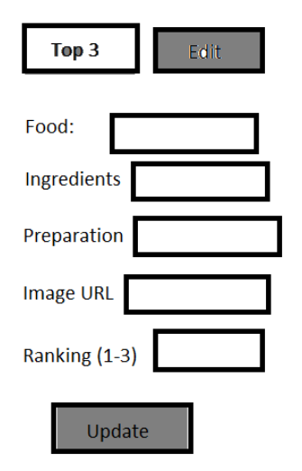

# CP4282 Assignment #3 Due Friday June 21st ( 25 marks total )

For this assignment you will modify your solution to assignment #3 further to include data persistence
using SQLite.

> (If your assignment #3 is not in good condition I will post Erics solution during the week of July 2nd when I have reviewed the submissions.)

- Modify the assignment to persist data entered into the edit form (shown below) to add new recipes and
treat the ranking as a scoring. 
- Then allow for any number of recipes to be included. 
    - This will involve
some interface modifications which we can discuss in the lab.

